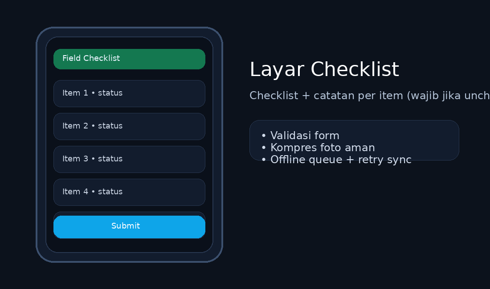
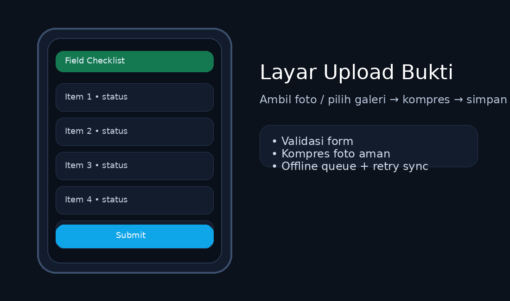
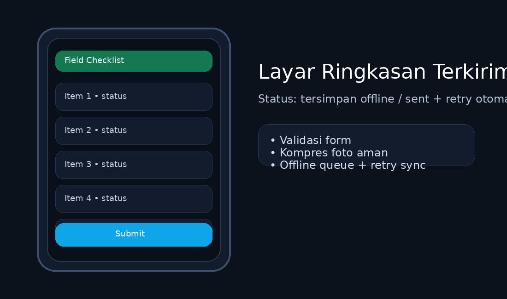

<div align="center">
  
  
  <br/>
  
</div>

---

## Tujuan dan Manfaat
## **Mobile Field Checklist App** membantu teknisi onsite menjalankan job dengan alur standar: **pilih job → centang checklist → tambah catatan/foto/lokasi → submit laporan**.
## Manfaat utama: **pekerjaan lapangan konsisten**, **bukti kerja lengkap**, dan **rekap administrasi lebih cepat**.

---

## Bahasa dan Teknologi
- ✅ **Swift**
- ✅ **SwiftUI**
- ✅ **iOS 16+**
- ✅ **Offline Queue + Auto Retry Sync**
- ✅ **Photo Compression + Location Attachment**

---

## Instalasi dan Persiapan
## **Requirement**
- ✅ macOS
- ✅ **Xcode 15+** (disarankan)
- ✅ **Homebrew** (untuk install XcodeGen)
- ✅ **XcodeGen** (generate .xcodeproj dari `project.yml`)
- ✅ iOS Simulator / iPhone (untuk test kamera & lokasi)

## **Install XcodeGen (Homebrew)**
```bash
brew install xcodegen
xcodegen --version
```

## **Clone / Buka Folder Proyek**
```bash
cd swift_mobile_field_checklist_app
```

---

## Proyek Full
## File ZIP proyek lengkap (source + assets + README) tersedia di rilis/attachment chat ini.

---

## Struktur File Proyek
```text
swift_mobile_field_checklist_app/
├─ project.yml
├─ generate_project.sh
├─ MobileFieldChecklistApp/
│  ├─ MobileFieldChecklistApp.swift
│  ├─ AppRootView.swift
│  ├─ Config.swift
│  ├─ Info.plist
│  ├─ Models.swift
│  ├─ Views/
│  ├─ ViewModels/
│  ├─ Services/
│  ├─ Utilities/
│  ├─ Resources/
│  │  └─ sample_jobs.json
│  └─ Assets.xcassets/
├─ assets/
│  ├─ preview_checklist.png
│  ├─ preview_upload.png
│  └─ preview_sent.png
└─ docs/
   └─ mock_server.md
```

---

## Cara Menjalankan
## **1) Generate Xcode Project**
```bash
xcodegen generate
open MobileFieldChecklistApp.xcodeproj
```

## **2) Jalankan di iOS Simulator**
- ✅ Pilih target iPhone Simulator
- ✅ Tekan **Run (▶)**

## **3) Jalankan di iPhone (kamera + lokasi)**
- ✅ Sambungkan iPhone
- ✅ Set **Signing & Capabilities** (pilih Team)
- ✅ Tekan **Run (▶)**

---

## Preview
## File preview sudah disiapkan di folder `assets/`.
- ✅ Checklist: `assets/preview_checklist.png`
- ✅ Upload bukti: `assets/preview_upload.png`
- ✅ Ringkasan terkirim: `assets/preview_sent.png`







---

## Anti-Error dan Troubleshooting
## Aplikasi sudah menghindari error umum di lapangan:
- ✅ **Validasi form**: item tidak dicentang wajib punya catatan minimal 4 karakter
- ✅ **Kompresi foto aman**: resize + turunkan quality sampai ukuran lebih kecil
- ✅ **Offline cache**: laporan + foto disimpan lokal di Documents
- ✅ **Retry sync**: exponential backoff (cap 5 menit) + nextRetryAt tersimpan di queue

## Jika kamera tidak muncul di Simulator
## Gunakan **Photos Picker** (galeri) atau jalankan di iPhone.

## Jika lokasi tidak terbaca
## Pastikan izin lokasi aktif: Settings → Privacy → Location Services → izinkan saat digunakan.
